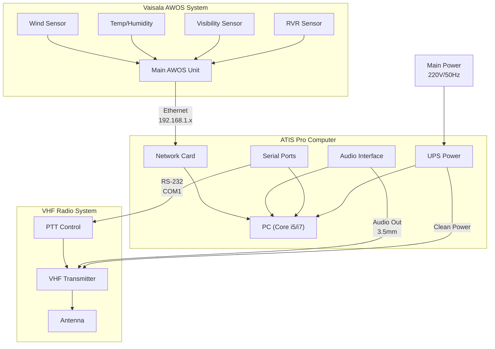

# ATIS Pro Connection Diagram



## Physical Connections

### 1. AWOS Connections
```
[Vaisala AWOS] ───────────────────────► [Computer]
    │                                       │
    └─► Network Port 1 ──► CAT6 Cable ──►  │
    └─► Serial Port (backup) ──► RS-232 ─►  │
```

### 2. Audio Connections
```
[Computer] ─────────────────────────► [VHF Radio]
    │                                     │
    └─► Audio Out ──► Audio Cable ──►    │
    └─► Serial Port ──► PTT Cable ──►    │
```

### 3. Power Connections
```
[Main Power 220V] ──► [UPS] ──┬──► [Computer]
                              ├──► [VHF Radio]
                              └──► [Network Switch]
```

## Port Assignments

### Computer Ports
1. **Network Ports**
   - ETH0: AWOS Connection (192.168.1.100)
   - ETH1: Airport Network (Optional)

2. **Serial Ports**
   - COM1: VHF Radio PTT
   - COM2: Backup AWOS (Optional)

3. **Audio Ports**
   - Line Out: VHF Radio Input
   - Line In: Test/Monitor (Optional)

### Cable Types

1. **Network Cables**
   - Type: CAT6 Shielded
   - Length: 10m (customize as needed)
   - Connectors: RJ45 with boots

2. **Serial Cables**
   - Type: RS-232
   - Length: 3m
   - Connectors: DB9 Male/Female

3. **Audio Cables**
   - Type: Balanced Audio
   - Length: 2m
   - Connectors: XLR or 1/4" TRS

## Grounding Requirements

1. **Equipment Grounding**
   ```
   [Ground Point] ──┬──► [Computer]
                    ├──► [VHF Radio]
                    ├──► [UPS]
                    └──► [Network Switch]
   ```

2. **Lightning Protection**
   ```
   [Lightning Arrestor] ──┬──► [Network Lines]
                         └──► [Power Lines]
   ```

## Power Requirements

1. **UPS Specifications**
   - Capacity: 2000VA
   - Runtime: 30 minutes
   - Input: 220V/50Hz
   - Output: Pure Sine Wave

2. **Power Distribution**
   ```
   [UPS] ──┬──► [Computer] (500W)
           ├──► [VHF Radio] (200W)
           └──► [Network Switch] (50W)
   ```

## Safety Notes

1. **Electrical Safety**
   - All power connections must be grounded
   - Use surge protectors
   - Label all cables
   - Keep documentation of connections

2. **Maintenance Access**
   - Leave 1m clearance for maintenance
   - Label all connection points
   - Document any changes
   - Keep spare cables on hand
